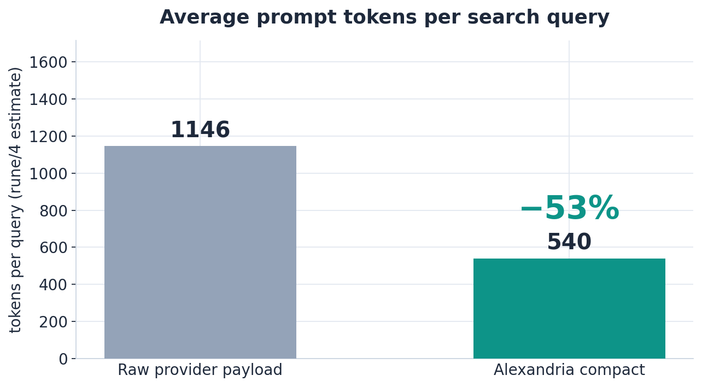
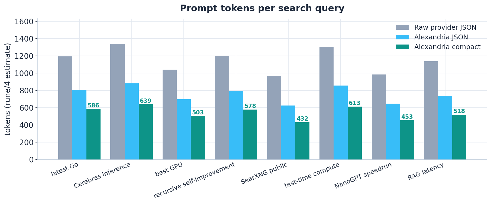
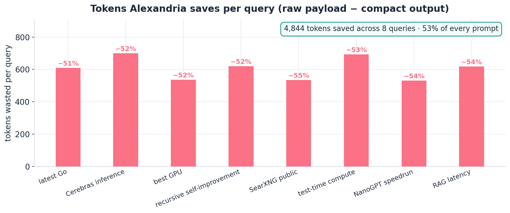

# Alexandria

One local search daemon for every LLM agent. Alexandria fronts Brave, Tavily,
SearXNG, Serper, Exa, and Google Custom Search behind a single provider-neutral
API, then normalizes, dedupes, and packs the results into a compact,
token-budgeted output format (TOON) that agents can afford to read.



## Why

Raw search responses are written for machines, not prompts. A single SearXNG
query returns engines, positions, thumbnails, parsed URLs, and score metadata
for every result — an LLM only needs the title, the link, and the snippet.
Alexandria strips the noise and packs what remains into the smallest
representation that still answers the question:





### The benchmark

Eight queries through the real binary against a live SearXNG fixture. Tokens
are estimated at 4 characters per token — the same estimator Alexandria's
budget enforces. Reproduce with `python3 tools/readme_bench.py`.

| query | results | raw JSON | alexandria JSON | compact | saved |
| --- | ---: | ---: | ---: | ---: | ---: |
| latest Go release notes | 7 | 1,195 | 805 | 586 | 51% |
| Cerebras inference throughput benchmarks | 8 | 1,339 | 882 | 639 | 52% |
| best GPU for training a 70B model | 6 | 1,040 | 696 | 503 | 52% |
| recursive self-improvement LLM research | 7 | 1,198 | 796 | 578 | 52% |
| SearXNG public instance list | 6 | 967 | 626 | 432 | 55% |
| test-time compute scaling laws | 8 | 1,306 | 856 | 613 | 53% |
| NanoGPT speedrun results | 6 | 984 | 646 | 453 | 54% |
| RAG latency optimization techniques | 7 | 1,137 | 737 | 518 | 54% |

**Total: 9,166 tokens as providers hand them over → 4,322 tokens
as Alexandria hands them to the model — 53% less, for the same answers.**

The same query, three ways (first result shown for the raw payload):

**What the provider sends — 1,195 tokens**

```json
{
 "query": "latest Go release notes",
 "number_of_results": 16800,
 "results": [
  {
   "url": "https://go.dev/doc/go1.24",
   "title": "Go 1.24 Release Notes - The Go Programming Language",
   "content": "Go 1.24 is the latest major release of the Go language, bringing generic type aliases, improved performance for the garbage collector, and a new crypto-related package set.",
   "engine": "google",
   "score": 1.0,
   "category": "general",
   "positions": [1],
   "engines": ["google", "brave"],
   "publishedDate": "2026-08-01T00:00:00+00:00",
   "thumbnail": "https://thumb.example.org/0.png",
   "template": "default.html",
   "parsed_url": ["https", "example.org", "/path", "", "", ""]
  }
 ]
}
```

*(First result shown; the real payload carries 7 results plus suggestions, corrections, and unresponsive_engines.)*

**What the model sees — 586 tokens**

```toon
query: latest Go release notes
sources[7]{id,title,url,snippet,source}:
  1,Go 1.24 Release Notes - The Go Programming Language,"https://go.dev/doc/go1.24","Go 1.24 is the latest major release of the Go language, bringing generic type aliases, improved performance for the garbage collector, and a new crypto-related package set that makes memory-safe primitives easier to use in production systems.",searx
  2,Go 1.24 released - Google Open Source Blog,"https://opensource.googleblog.com/2026/02/go-1-24-released.html","The Go team announces Go 1.24 with a 20 percent reduction in allocation overhead for large heaps, faster builds on multi-core machines, and the long-awaited generic type aliases proposal implemented behind a stable language flag.",searx
  3,What's new in Go 1.24 - The Register,"https://www.theregister.com/2026/02/11/golang_124_release/","A look at the headline features of Go 1.24 including structured concurrency experiments, iterators over slices, and the new weak package that lets developers build memory-efficient caches without finalizers.",searx
  4,"Go 1.24 Release Notes: generics, weak pointers, and more","https://blog.golang.org/2026/go-1.24","The official Go blog walks through the changes in Go 1.24: type aliases for generics, the weak package for ephemeron-style caches, improved runtime performance, and quality-of-life changes to go vet and the toolchain.",searx
  5,Download Go 1.24 - official release binaries,"https://go.dev/dl/","Download Go 1.24 for Linux, macOS, Windows, and other platforms. Source tarballs and checksums are available, along with install instructions for beginners and package manager integration.",searx
  6,"Go 1.24 vs Go 1.23: benchmark comparison","https://benchmarks.example.org/go/1.24-vs-1.23","Independent benchmarks compare Go 1.24 with 1.23 across compile time, runtime performance, and memory usage. The new release is measurably faster for typical web services.",searx
  7,"Migrating to Go 1.24: what breaks","https://migration-guides.example.org/golang/1.24","A practical migration guide covering the few compatibility changes in Go 1.24, including the new behavior of range-over-int, deprecation notices, and recommended toolchain settings for CI pipelines.",searx
```

## What it does

- **Provider-neutral.** One endpoint for Brave, Tavily, SearXNG, Serper, Exa,
  and Google CSE. API keys stay server-side; agents never see provider
  payloads or authentication.
- **Normalized and deduped.** URLs canonicalized, tracking parameters
  stripped, duplicates removed across providers, ranking deterministic
  regardless of which provider finishes first.
- **Hard token budget.** `max_tokens` is enforced against the actual
  serialized output, not an estimate. Snippets are truncated greedily at word
  boundaries; title and URL always survive.
- **Failure-tolerant.** A slow or dead provider never discards good results.
  HTTP 502 only when every provider fails; per-provider timeouts, retries with
  backoff, and a self-healing public SearXNG instance pool by default.
- **Operable.** Optional auth and per-client rate limiting, request IDs that
  propagate to providers, readiness probes, graceful shutdown, and a tiny
  footprint (pure stdlib, single static binary).

## Install

The easiest way is the npm daemon — no Docker, no Go toolchain:

```bash
npm install -g alexandria-search
alexandria start                             # daemonize the gateway on :8080
alexandria search 'latest Go release notes' # compact output, ready for an LLM
alexandria status && alexandria logs -n 50
alexandria stop                              # graceful SIGTERM
```

Or the container:

```bash
docker build -t alexandria .
docker run --rm -p 8080:8080 --env-file .env alexandria
```

Or from source (Go 1.23+):

```bash
make build
./bin/alexandria
```

## Quick start

```bash
cp .env.example .env
# set BRAVE_SEARCH_API_KEY and/or TAVILY_API_KEY in your shell (never commit .env)
go test ./...
go run ./cmd/alexandria
```

```bash
curl -sS 'http://localhost:8080/v1/search?q=Go%20context%20cancellation&max_results=5&max_tokens=500' \
  -H 'accept: text/toon'
```

## API

Endpoints: `GET /healthz`, `GET /readyz`, `GET /openapi.json`, and
`GET|POST /v1/search` (aliases: `/search`, `/api/search`). Search responses
default to the compact format; use `format=json` or `Accept: application/json`
for JSON diagnostics, or `format=text|html` for other projections.

```json
{"query":"latest Go release","max_results":5,"max_tokens":600,"providers":["brave"],"freshness":"pw"}
```

The response includes `results`, per-provider `ok/error/results/latency_ms`
statuses, and `usage` (`output_tokens`, `max_tokens`, `truncated`,
`estimated`). Validation errors are 400; all-providers-failed is 502; provider
timeouts are 504; client cancellations are 499.

## Configuration

| Variable | Purpose |
| --- | --- |
| `ALEXANDRIA_ADDR` | listen address (default `:8080`) |
| `ALEXANDRIA_API_KEY` | require a bearer / `X-API-Key` on search endpoints |
| `ALEXANDRIA_RATE_LIMIT` | requests/minute per client (0 disables) |
| `BRAVE_SEARCH_API_KEY`, `TAVILY_API_KEY`, `SERPER_API_KEY`, `EXA_API_KEY` | provider keys (any subset) |
| `GOOGLE_CSE_API_KEY` + `GOOGLE_CSE_ID` | Google Programmable Search |
| `SEARX_URL` | fixed SearXNG instance; default is the public online pool |
| `ALEXANDRIA_DEFAULT_MAX_TOKENS`, `ALEXANDRIA_MAX_TOKENS`, `ALEXANDRIA_MAX_RESULTS` | request defaults and caps |
| `ALEXANDRIA_REQUEST_TIMEOUT` | per-provider timeout (default `12s`) |

The npm daemon also accepts `ALEXANDRIA_ENV_FILE`, `ALEXANDRIA_RUNTIME_DIR`,
`ALEXANDRIA_BIN`, and `ALEXANDRIA_URL`; see `alexandria help`.

## Development

```bash
make test        # go test ./...
make build       # static binary with version stamping
python3 tools/readme_bench.py   # regenerate the benchmark above
python3 tools/readme_charts.py  # regenerate the charts
```

GitHub Actions runs Go race tests, vet, builds, the npm daemon integration
test, and Python harness checks. `tools/jcode.py` is a small OpenAI-compatible
harness for end-to-end LLM smoke tests; a persistent Colab node named
`alexandria` can be used for sleep-safe remote runs.

## Status

Early MVP, actively developed: Brave, Tavily, SearXNG (public pool), Serper,
Exa, and Google CSE adapters are complete; Bing remains as a legacy adapter.
Roadmap: provider circuit breakers and result caching, optional opt-in page
extraction with its own budget, exact tokenizer plugins, and evaluation
fixtures for answer quality per token and cost per query.

## License

[MIT](LICENSE)
